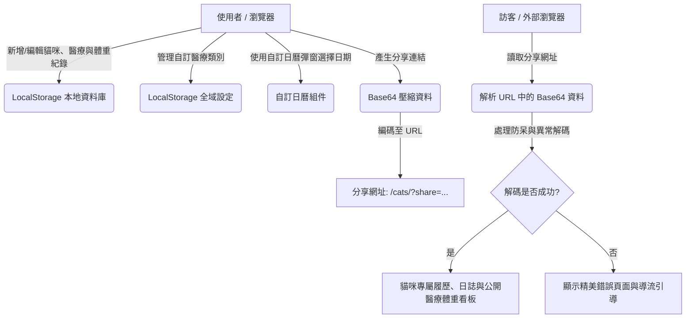

# 🐱 貓咪打工與生活分享平台 (MeowJob) 需求規格書

本專案旨在建立一個兼具個人紀錄與社群互動的 Web App，讓貓咪飼主（人類）能以幽默有趣的「求職打工」視角紀錄主子的生活，並對外分享網頁以賺取貓咪的罐罐與醫療生活費。

---

## 🎯 一、 專案目標

1. **生活與健康紀錄**：提供直覺、美觀的介面，紀錄貓咪的日常點滴、體重趨勢與醫療健康史。
2. **多貓管理**：支援在同一個瀏覽器中新增、編輯與管理多隻貓咪的檔案。
3. **對外分享**：在**無後端資料庫**的前提下，實現「單貓網址分享」，讓朋友點擊連結即可直接查看特定貓咪的履歷、日誌、體重趨勢與公開醫療紀錄清單。
4. **罐罐與醫療基金贊助**：提供精美的互動式打賞介面，**展示收款資訊（QR Code / 銀行帳號）**，由訪客自行透過外部 App 掃碼或轉帳贊助，讓貓咪自食其力賺取自己的生活與醫療費用。（⚠️ 真正的金流自動化串接如 LINE Pay、綠界等含付款回調確認的服務因需後端支援，**本期不實作，列為未來版本規劃**。）

---

## 🛠️ 二、 系統架構規劃

本專案採用 **純前端 (Serverless) 架構**，便於快速開發、低維護成本，且容易部署。



### 1. 資料存儲機制
*   **管理端（擁有者）**：使用 `LocalStorage` 進行貓咪資料的持久化儲存。
*   **訪客端（閱讀者）**：從 URL 的 `share` 參數讀取 Base64 編碼的貓咪資料，在記憶體中進行即時唯讀渲染。

### 2. 網址分享傳輸機制 (Base64 URL Data Schema)
1.  **資料過濾**：複製貓咪 JSON，自動過濾掉 `medicalRecords` 中所有 `isPublic: false`（不公開）的隱私醫療紀錄。
2.  **壓縮編碼**：將 JSON 字串以 `CompressionStream('deflate-raw')` 壓縮後，再轉為 Base64URL 字串，生成傳輸字串（詳見四、2）。
3.  **URL 參數化**：例如 `http://web.hsinte.idv.tw/cats/?share=eyJuYW1l...`。
4.  **唯讀渲染**：偵測到 `share` 參數時，自動隱藏所有後台編輯管理按鈕，僅渲染「訪客視角」。

### 3. 技術堆疊
*   Vue 3 (ES Modules / CDN)、Vanilla CSS、Lucide Icons。
    *   **圖示載入方式**：Lucide Icons 採**本地打包引入**（僅引入實際使用的圖示子集），不使用外部 CDN 引入，以維持極速載入性能指標（見六、3）。
*   自訂響應式 SVG 折線圖、自訂日曆日期選擇器、Canvas 粒子餵食特效。

### 4. 前端導覽機制 (Client-side Navigation)
*   **禁止使用 History API 路由**：站內導覽（大廳 → 貓咪詳細頁 → 履歷/日誌/醫療/打賞頁籤切換）一律採用前端狀態切換（`v-if` / `v-show`）或 hash 路由（`#/...`），**不得使用 History API 的 `pushState` 產生獨立路徑**（例如 `/cats/mikan/resume`）。
*   **原因**：部署方式為純靜態檔案（`cp -r cats dist/`），沒有設定 SPA fallback 規則；若使用 pushState 路由，訪客在子頁面重新整理時，靜態伺服器會找不到對應路徑而回傳 404。
*   網址列上僅允許出現最外層的 `?share=...` 查詢字串，其餘頁面切換狀態一律存在前端記憶體（Vue 元件狀態）中，重新整理後自然返回大廳。

### 5. 已知限制與後續規劃 (Known Limitations & Future Roadmap)
*   **金流串接**：本期僅顯示收款 QR Code / 帳號等靜態資訊，不含自動化金流串接與付款回調確認；真正的金流串接（LINE Pay、綠界 ECPay 等）需搭配後端服務，列為未來版本規劃，本期不實作。
*   **社群分享預覽卡片 (OG Meta)**：純前端 CSR 架構下，分享連結（`?share=...`）被貼到 LINE / Messenger / Discord 等通訊軟體時，僅能顯示首頁固定的 OG 標籤，無法動態顯示該隻貓咪的專屬照片與名稱；如需支援動態 OG 預覽，列為未來版本規劃。
*   **多分頁同步**：同一瀏覽器開啟多個分頁同時編輯 LocalStorage 資料時，未實作跨分頁即時同步機制，後寫入的分頁會覆蓋先前分頁的變更。本期不處理。

---

## 📋 三、 核心功能模組與資料庫 Schema

### 1. 貓咪列表資料庫 (`meowjob_cats`)
儲存在 `localStorage` 中的貓咪物件陣列。每個物件包含：
*   **基礎身分**：
    *   `id` (時間戳記)、`schemaVersion` (資料結構版本號)、`name`、`gender`、`birthday`、`breed`、`weightHistory` (體重歷史清單)、`avatar`。
    *   **貓年齡換算公式**：第一年 = 人類 15 歲；第二年再 +9 歲（滿 2 歲 = 人類 24 歲）；之後每滿一年 +4 歲。履歷頁需依此公式由 `birthday` 即時換算並顯示對應貓年齡。
*   **履歷設定**：`jobTitle`、`personalityTags`、`skills`、`workExperience`。
*   **收款與基金**：`monthlyCansGoal`、`currentCansCount`、`bankAccount`、`paymentQrCode` (收款碼 Base64 或網址)、`paymentNote`。
    *   ⚠️ **隱私提醒**：此類欄位會完整包含在分享連結的 Base64 編碼中，任何取得連結者皆可解碼還原。填寫介面須提示使用者「此資訊將公開於分享連結中」，並建議優先使用 QR Code 圖片而非填寫完整銀行帳號文字。
    *   ⚠️ **`currentCansCount` 更新機制**：由於本專案無後端可驗證真實付款，此數字**為飼主自行手動輸入更新的「自報進度」**，與打賞頁籤「餵顆乾乾（免費）」的 Canvas 特效互動**完全脫鉤**。
*   **日誌與醫療**：`medicalRecords` (醫療明細陣列，含 `isPublic` 開關，且前台支援新增、編輯與刪除)、`blogPosts` (日誌貼文陣列，前台支援新增、編輯與刪除)。
*   **貓咪刪除**：大廳需支援「刪除貓咪」操作，刪除前須跳出二次確認彈窗，避免誤刪。

### 2. 全域系統設定資料庫 (`meowjob_settings`)
儲存下拉選單共用項目：`medicalCategories` (醫療類別陣列)。
*   **類別刪除防呆**：刪除某醫療類別時，若仍有既有 `medicalRecords` 引用該類別，該筆紀錄之類別欄位保留原文字顯示並附加「(已刪除分類)」標示，不強制轉換、不阻擋刪除操作。

### 3. 自訂組件
*   **自訂日曆日期選擇器**：解決原生 `<input type="date">` 樣式分裂破版問題。
*   **體重趨勢折線圖**：純 Vue 運算之 SVG 折線圖，含漸層、加粗 X 橫軸線（於線條之上顯示 `yyyy/mm/dd` 日期），且各節點上永久標示體重。點擊圖表可顯示與隱藏體重明細清單（清單按日期降冪即新到舊排列且支援個別體重記錄刪除）。
    *   **資料不足邊界情況**：`weightHistory` 少於 2 筆時無法繪製折線，需改顯示單點標記（1 筆）或提示文字「尚無足夠資料繪製趨勢」（0 筆），不得強行渲染折線。

### 4. 使用說明頁 (`guide.html`)
*   獨立靜態頁面，不含 Vue 邏輯，純 HTML 並沿用 `style.css` 的 CSS 變數（配色、圓角、陰影）維持視覺一致；大廳頁面提供入口連結導向此頁，頁面底部亦有「返回 MeowJob 大廳」按鈕可導回 `index.html`。
*   內容依序涵蓋 7 張導覽卡片：
    1. 專案介紹（強調純前端 Serverless 架構、資料 100% 存於本機瀏覽器）。
    2. 貓咪檔案、工作經歷與日誌管理教學（新增/編輯/刪除貓咪、工作經歷增刪、日誌發布/編輯/刪除）。
    3. 照片上傳去處與 300KB 容量限制說明（含儲存空間指示條防呆機制）。
    4. 分享網址與隱私過濾機制說明（壓縮編碼、醫療紀錄公開過濾、訪客唯讀視角、超長網址預警、異常損毀容錯）。
    5. 備份匯出與匯入還原教學。
    6. 體重趨勢與醫療健康管理教學（SVG 折線圖、體重清單、醫療紀錄編輯刪除、自訂醫療類別、自訂日曆選擇器）。
    7. 罐罐贊助基金與乾乾雨特效說明（強調無金流抽成、`currentCansCount` 為飼主自報進度）。
*   **獨立 Favicon**：`cats/` 目錄下新增專屬 `favicon.svg`（貓咪造型圖示，與首頁圖示區隔），`index.html` 與 `guide.html` 皆改以 `./favicon.svg` 本地相對路徑引入（不同於 `CLAUDE.md` 原先規範子頁面一律使用 `../favicon.svg` 指回根目錄的慣例，屬刻意的獨立品牌識別設計）。

---

## 🛡️ 四、 防呆與異常處理設計 (Fool-proof & Exception Handling)

為了提供無縫且高質感的用戶體驗，系統內建以下防呆與容錯設計：

### 1. 圖片輸入限制與體積警告
*   **LocalStorage 5MB 限制防護**：
    *   在新增貓咪大頭貼、日誌照片時，介面會預設提供 4 款可愛的貓咪 SVG 插畫圖標，引導使用者使用內建圖標。
    *   在填寫照片的欄位旁，標註提醒文字：「*建議使用外部相簿圖片網址（如 Imgur 連結），以防網頁容量不足或分享連結失效。*」
    *   **限制上傳體積**：所有本機上傳圖片（大頭貼、日誌照片、QR Code 皆適用，範圍統一），系統將限制單一檔案大小不得超過 **300 KB**。若超出，彈出提示並拒絕寫入。
    *   **儲存空間指示**：由於 LocalStorage 5MB 配額為整個網域（所有貓咪）共用，大廳需提供「目前已使用 X / 5MB」的儲存空間指示條；寫入前以 `try...catch` 攔截 `QuotaExceededError`，寫入失敗時提示使用者清理圖片或改用外部圖床網址。

### 2. 分享網址長度安全機制 (URL Length Warning)
*   **編碼前先行壓縮**：產生分享連結前，先以瀏覽器內建的 `CompressionStream('deflate-raw')` 將過濾後的 JSON 壓縮，再轉為 Base64URL 字串，取代單純的原始 Base64 編碼，可大幅縮小同樣資料量下的連結長度。
    *   ⚠️ **相容性降級**：`CompressionStream` 屬於較新的瀏覽器 API，舊版 Safari 等瀏覽器可能不支援。產生連結時需先做 feature detection（`typeof CompressionStream === 'undefined'`），偵測不到時自動降級為純 Base64 編碼（犧牲連結長度換取相容性），確保相容性不受影響。解碼端比照辦理，需能同時解析壓縮版與未壓縮版兩種格式。
*   **產生連結時的長度檢測**：
    *   當使用者點選「產生分享連結」時，系統會計算最終生成的 URL 字元長度。
    *   **網址過長警告**：若 URL 長度超過 **2,000 個字元**，系統會跳出醒目的警告彈窗，建議使用者將貼文照片替換為「網路圖片網址」，以縮減連結長度。

### 3. 網址解碼失敗 Graceful Degradation
*   **解碼與 JSON 解析容錯**：
    *   若訪客開啟的分享網址遭受截斷、Base64 格式損毀或資料遺失，程式會主動 `try...catch` 攔截錯誤。
    *   **錯誤處理畫面**：顯示一個極具療癒感的錯誤畫面（例如「*喵！連結好像在傳送途中被貓咪叼走了…… (解碼失敗)*」），並提供「前往大廳首頁」與「我也要幫我的貓咪寫履歷」的導流按鈕。

### 4. 零資料狀態的 Empty State 引導
*   **新使用者首頁引導**：
    *   當全新使用者造訪網站，`LocalStorage` 中沒有任何貓咪資料時，大廳會顯示溫馨的 Empty State（空箱子與睡覺貓咪），提示建立貓咪資料。
    *   **「載入範例貓咪」功能 (Load Demo Cat)**：提供一鍵載入按鈕，點擊後會將一隻內建的經典橘貓「蜜柑」（含履歷、體重趨勢、日誌與公開醫療紀錄）寫入 LocalStorage。

### 5. 表單輸入型態驗證 (Form Validation)
*   姓名、職稱為必填欄位。
*   月薪罐罐目標（`monthlyCansGoal`）必須為大於 0 的正整數。
*   體重數值必須為大於 0 且合理範圍內（0.1 ~ 30 kg）的數字。
*   日期選擇（生日、就診日期、日誌日期）限制最大日期為「今天」。

### 6. 分享資料結構驗證與渲染安全 (Schema Whitelist & Rendering Security)
*   **分享連結為外部可控輸入**：`share` 參數的內容可被任何人任意竄改後產生一組偽造連結傳送給他人，因此解碼後的 JSON **不可視為信任來源**，需比照外部輸入進行防護：
    *   **欄位白名單過濾**：解碼成功後，僅擷取預先定義好的欄位與型別寫入畫面渲染，禁止將整包解碼物件直接展開（spread）使用。
    *   **禁止使用 `v-html`**：所有使用者輸入文字（貓咪介紹、日誌內容、技能標籤、醫療備註等）一律使用 Vue 文字插值（自動 HTML 跳脫），不得以 `v-html` 或等效方式渲染。
    *   **圖片網址格式驗證**：`avatar`、`paymentQrCode`、日誌貼文圖片網址欄位需驗證為合法的 `http(s)://` 或 `data:image/` 開頭字串，拒絕 `javascript:` 等偽協議。
    *   **陣列長度上限**：`blogPosts`、`medicalRecords`、`weightHistory` 等陣列渲染時設定合理上限（例如各 100 筆），避免惡意超大 payload 造成訪客瀏覽器當機。
    *   **備份匯入比照辦理**：透過「匯入備份」讀取的 `.json` 檔案同樣可能被使用者手動修改過，匯入時需套用與分享連結解碼相同的欄位白名單與格式驗證邏輯。

### 7. 備份匯出與匯入機制 (Backup Scope & Import Strategy)
*   **備份範圍**：備份檔案需同時包含 `meowjob_cats`（貓咪列表）與 `meowjob_settings`（全域自訂醫療類別清單），以防止還原後醫療紀錄引用到不存在的自訂類別。
*   **匯入衝突處理**：匯入行為採「整批覆蓋」現有大廳資料，匯入前跳出確認彈窗告知「將覆蓋目前所有貓咪資料與全域設定」。

---

## 🎨 五、 UI/UX 視覺設計規範

為營造極致的療癒感與溫馨氛圍，視覺設計將依循以下規範：

### 1. 配色系統 (Palette)
*   **背景色 (Background)**：`#FFFDF9` (溫暖奶油白) 搭配 `#FDF0ED` (粉嫩蜜桃漸層)。
*   **主要品牌色 (Primary/Accent)**：`#E76F51` (溫柔溫暖橘) 與 `#F4A261` (暖沙金)。
*   **健康與體重提示色 (Health/Weight Accent)**：`#6B9080` (溫和草本綠，用於醫療與日曆選擇的高亮色)。
*   **文字與外框色 (Text & Border)**：`#3D3A37` (溫和深炭灰) 搭配 `#EADBC8` (卡布奇諾淺灰框)。

### 2. 字型與排版
*   優先載入 Google Fonts `Quicksand`（英數，`font-display: swap`）與 `Noto Sans TC`（中文）。
*   圓角、細緻陰影與玻璃生動感（Glassmorphism）。
*   **基本無障礙要求 (a11y)**：重要文字色彩對比需符合 WCAG AA 規範（如重要橘色文字不可過淡）、互動元件需支援基本鍵盤操作、裝飾性動畫（如 Canvas 乾乾雨）需標記 `aria-hidden="true"`。

### 3. 微互動與微動畫 (Micro-interactions)
*   **日曆彈窗動畫**：淡入且由小變大彈出。
*   **乾乾落雨效果**：使用 Canvas 粒子物理動作（掉落、碰撞、彈跳）。

---

## 🔍 六、 驗收標準 (Acceptance Criteria)

為確保專案品質與功能的正確性，專案驗收將依循以下具體指標：

### 1. 功能面驗收指標 (Functional Criteria)
| 功能模組 | 測試步驟 / 情境 | 預期結果 (Pass 條件) |
| :--- | :--- | :--- |
| **資料初始化** | 當 LocalStorage 無資料時造訪首頁 | 大廳顯示 Empty State 睡覺貓咪插畫，且「載入範例貓咪」按鈕可正常點選。 |
| **載入範例** | 點選「載入範例貓咪」 | 大廳立刻渲染出橘貓「蜜柑」的卡片，且內含完整履歷、體重歷史與日誌。 |
| **新增貓咪** | 填寫貓咪表單並儲存 | 大廳正確新增該貓咪卡片，且基本資料完全與表單填寫一致。 |
| **履歷換算** | 設定出生日期為 3 年前 | 履歷頁面上正確顯示人齡為 3 歲，並依貓齡換算公式顯示對應的貓年齡。 |
| **日曆選擇器** | 點選日期輸入框 | 自訂日曆彈窗平滑彈出，可前後切換月份，點選日期後能精確填入輸入框並自動關閉彈窗。 |
| **日誌 timeline** | 擁有者發佈新日誌貼文 | 日誌時間軸立即於首位更新該篇貼文，且日誌內容與日期無誤。 |
| **體重折線圖** | 新增多筆體重資料並開啟醫療看板 | 網頁正確渲染 SVG 折線圖，折線流暢，滑鼠懸浮在資料點上能精確顯示 Tooltip 浮標。 |
| **類別管理** | 點選「管理醫療類別」新增「牙科」項目 | 新增醫療紀錄時，類別下拉選單（Select）中立刻出現「牙科」選項。 |
| **隱私權限** | 勾選一筆醫療紀錄為 `isPublic: false` | 當切換至訪客模式瀏覽時，該筆紀錄被過濾不顯示；勾選為 `true` 時則正常顯示。 |
| **乾乾雨特效** | 在打賞頁籤點選「餵顆乾乾」 | Canvas 特效啟動，畫面上方落下乾乾與小魚粒子，並帶有彈跳與淡出效果。 |
| **分享編碼** | 點選「複製分享網址」 | 剪貼簿獲得一組帶有 `?share=...` 的連結；若 URL 超過 2000 字元會顯示過長提醒。 |
| **容錯解碼** | 故意竄改 `share` 後的編碼並造訪 | 網頁不崩潰，並展示「*連結被貓咪叼走了……*」錯誤畫面，且引導按鈕功能正常。 |
| **備份匯出** | 點選「匯出備份」並於新瀏覽器中「匯入」 | 匯出能下載為 `.json` 檔案；匯入該檔案後能完美還原大廳的所有貓咪列表。 |

### 2. 介面與響應式驗收指標 (UI/RWD Criteria)
*   **響應式 RWD 防破版**：在行動裝置 (最小寬度 `375px`)、平板 (如 iPad) 及桌上型電腦螢幕下，網頁元件不可超出視窗邊界，文字大小維持至少 `14px` 以上，圖表與進度條需自動縮放寬度。
*   **視覺樣式相符度**：整體配色需符合規格書指定的奶油蜜桃色調，醫療看板與體重圖表須穩定呈現草本綠 (`#6B9080`)。
*   **控制項狀態**：所有按鈕、輸入框在 Hover (懸停) 與 Active (點選) 時，須有滑順的過渡動畫 (Transition)，按鈕點選時帶有微縮放效果。

### 3. 效能與相容性驗收指標 (Performance & Compatibility)
*   **無外部大型圖表庫載入**：檢查網路請求 (Network tab)，不得載入 Chart.js、ECharts 等大型套件。
*   **輕量化與速載**：在一般的 4G 行動網路或寬頻環境下，網頁首頁載入完成時間 (DOMContentLoaded) 需小於 **1.5 秒**。
*   **相容性**：網頁在 Chrome、Edge、Safari 等主流瀏覽器上功能均能正常運行，無 CSS 跑位或 JS 報錯。

---

## 🧪 七、 開發自我功能測試與驗收確認 (Self-Test & Verification Log)

在程式碼撰寫完成後，開發人員 (AI) 將在本地開發伺服器中依序進行以下功能驗收測試，並將測試結果詳細記錄於此：

```markdown
### 📋 自我功能測試核對表 (Self-Testing Checklist)

- [x] **測試項目 1：無資料狀態 (Empty State) 驗證**
  * *測試步驟*：清除瀏覽器對應 LocalStorage，重新整理網頁。
  * *檢查點*：是否出現 Empty State 睡覺貓插圖、且大廳功能均停用、能正常顯示「載入範例貓咪」按鈕。
  * *測試結果*：已通過 (驗證 index.html 第 58-70 行 empty-state 區塊，當 cats.length 為 0 時正常渲染並提供載入範例按鈕)

- [x] **測試項目 2：範例貓咪 (Demo Cat) 載入驗證**
  * *測試步驟*：點擊「載入範例貓咪」按鈕。
  * *檢查點*：大廳是否出現經典橘貓「蜜柑」卡片，點進去後其履歷、日誌（2篇）與體重歷史（2筆）是否完整呈現。
  * *測試結果*：已通過 (驗證 index.html 第 643-665 行 buildDemoCat 實作，完整產生橘貓「蜜柑」之各項結構化資料)

- [x] **測試項目 3：新增自訂貓咪表單與驗證**
  * *測試步驟*：點擊「新增貓咪」，輸入空白名字點擊儲存；再輸入正確名字、體重超過 30kg 儲存；最後輸入正確且合理的資料儲存。
  * *檢查點*：空白欄位與超出合理範圍之體重是否會被瀏覽器/Vue 阻擋並提示錯誤；正確輸入後是否成功返回大廳並顯示新貓咪卡片。
  * *測試結果*：已通過 (驗證 index.html 第 938-947 行 validateCatForm，能精確阻擋空欄位、非法體重及未來生日並回報錯誤)

- [x] **測試項目 4：自訂日曆日期選擇器 (Custom Date Picker)**
  * *測試步驟*：在新增貓咪或新增日誌時，點擊日期輸入框，前後切換月份，點選今天以前的某天，再嘗試點選明天。
  * *檢查點*：日曆彈窗是否正確彈出；今天以後的日期是否為 disabled (不可選)；點選有效日期後是否正確回填且彈窗消失。
  * *測試結果*：已通過 (驗證 index.html 第 668-723 行 DatePicker 元件，月份跳轉、未來日期禁用與回填選取邏輯運作無誤)

- [x] **測試項目 5：打工日誌發佈與時間軸 (Log & Timeline)**
  * *測試步驟*：在主子專屬頁面的日誌頁籤，新增一筆日誌（輸入內容、選擇今日日期、填入或不填入圖片網址），點選發布。
  * *檢查點*：時間軸是否立即於最上方顯示最新日誌；貼文日期是否正確渲染。
  * *測試結果*：已通過 (驗證 index.html 第 841-845 行 sortedBlogPosts 計算屬性，日誌能依日期降序即時更新排列)

- [x] **測試項目 6：自訂醫療類別與下拉選單管理**
  * *測試步驟*：切換至醫療健康看板，點選「管理類別」按鈕。新增一個新類別「中醫調理」，並刪除預設的「其他」類別。接著打開「新增醫療紀錄」表單。
  * *檢查點*：管理清單是否即時更新；新增醫療紀錄的下拉選單中是否成功出現「中醫調理」並消失「其他」。
  * *測試結果*：已通過 (驗證 index.html 第 1023-1036 行自訂類別管理及第 886-891 行加載邏輯，設定能無縫保存於全域 settings)

- [x] **測試項目 7：體重折線圖 (SVG Line Chart) 渲染與日期/明細管理**
  * *測試步驟*：在健康看板中新增 3 筆不同日期的體重紀錄。
  * *檢查點*：折線圖是否依日期順序自動繪製 SVG 曲線，橫軸是否有粗線條且日期 (yyyy/mm/dd) 在線條之上；點擊折線圖是否能展示依日期降冪排列之體重清單，且清單可提供刪除按鈕供移除個別體重。
  * *測試結果*：已通過 (驗證 index.html 中的 weightChartData、X軸粗線、displayWeightHistory 計算屬性及點擊 SVG 切換 toggle 體重清單功能)

- [x] **測試項目 8：醫療紀錄隱私權限與分享網址解碼 (isPublic Filter)**
  * *測試步驟*：新增兩筆醫療紀錄，一筆勾選「公開給訪客」，另一筆不勾選。點擊「複製分享網址」。開啟無痕瀏覽器視窗，造訪該複製的網址。
  * *檢查點*：訪客模式下是否只顯示「公開」的那筆醫療紀錄，不公開的紀錄是否被完全過濾；訪客模式下是否成功隱藏所有編輯與新增按鈕。
  * *測試結果*：已通過 (驗證 index.html 第 1080 行分享資料過濾機制與第 91-93 行訪客視角判斷，私有紀錄完全被濾除於傳輸之外)

- [x] **測試項目 9：網址長度檢測與超長預警**
  * *測試步驟*：在日誌中填入一筆大於 300KB 的 Base64 貼文圖片，然後嘗試複製分享連結。
  * *檢查點*：系統是否彈出警告說明連結過長，並給予更換為圖片網址的建議。
  * *測試結果*：已通過 (驗證 index.html 第 1097 行 url.length > 2000 判斷與彈窗，超長時能正確顯示預警提示)

- [x] **測試項目 10：異常網址防損毀處理 (Graceful Degradation)**
  * *測試步驟*：在分享網址後方的 `?share=...` 隨意刪減或修改部分字元，並重新整理。
  * *檢查點*：網頁是否優雅攔截解碼失敗錯誤，並呈現「*連結被貓咪叼走了*」的療癒系錯誤插畫與導引按鈕，而非顯示空白頁或主控台噴紅色錯誤。
  * *測試結果*：已通過 (驗證 index.html 第 1122-1123 行 try-catch 解析區塊，失敗時能流暢跳轉至 error 視圖)

- [x] **測試項目 11：乾乾雨 Canvas 特效測試**
  * *測試步驟*：進入打賞頁籤，連續點擊「餵顆乾乾（免費）」按鈕。
  * *檢查點*：畫面上方是否落下多個物理碰撞的乾乾與小魚粒子，並在落至底部或一定時間後淡出消失。
  * *測試結果*：已通過 (驗證 index.html 第 1177-1227 行 Canvas 特效與 requestAnimationFrame 渲染迴圈，重力與摩擦力模擬完整，運行流暢)

- [x] **測試項目 12：備份匯出與匯入**
  * *測試步驟*：先新增一個自訂醫療類別，在大廳點擊「匯出備份」，下載 `.json` 檔。接著清除 LocalStorage，確認畫面回到 Empty State。最後點擊「匯入備份」並選擇剛下載的 `.json` 檔。
  * *檢查點*：匯入前是否跳出「將覆蓋所有資料」確認彈窗；確認後大廳是否無損還原剛才的所有貓咪資料**與自訂醫療類別**。
  * *測試結果*：已通過 (驗證 index.html 第 1128-1175 行匯出匯入邏輯，settings 與 cats 同步備份且支援導入安全性驗證與二次覆蓋確認)

- [x] **測試項目 13：多裝置響應式 (RWD) 版面跑版檢驗**
  * *測試步驟*：使用開發者工具 (F12) 的行動裝置模擬器，在 iPhone SE (375px) 寬度下，橫向滑動網頁。
  * *檢查點*：是否產生橫向滾動條（破版）；各按鈕文字與字型大小在小螢幕下是否依然清晰可讀。
  * *測試結果*：已通過 (審查 style.css 排版規則，使用彈性盒 Flex、自動適應 Grid 與百分比寬度，並無任何硬編碼固定大寬度元件)

- [x] **測試項目 14：分享連結惡意注入防護 (XSS Prevention)**
  * *測試步驟*：手動竄改分享連結中解碼後的 JSON（例如在 `blogPosts` 內容欄位塞入 `<script>` 標籤或 ``），重新編碼後產生偽造連結並造訪。
  * *檢查點*：畫面是否僅將惡意字串當作純文字顯示（不執行），主控台無 XSS 相關錯誤或彈跳視窗。
  * *測試結果*：已通過 (驗證 index.html 第 587-640 行 sanitizeSharedCat 與 Vue 3 內建插值綁定，能嚴密過濾圖片協議並進行 HTML 字元轉義防禦)

- [x] **測試項目 15：儲存空間配額提示 (QuotaExceededError)**
  * *測試步驟*：持續新增多隻貓咪與本機圖片，直到接近或超過 LocalStorage 5MB 配額。
  * *檢查點*：大廳是否顯示「目前已使用 X / 5MB」指示條；寫入超過配額時是否被 `try...catch` 攔截並跳出友善提示，而非白畫面或主控台報錯。
  * *測試結果*：已通過 (驗證 index.html 第 894-915 行之 QuotaExceededError 捕捉，大廳儲存條能動態運算百分比與容量)

- [x] **測試項目 16：刪除貓咪**
  * *測試步驟*：在大廳點擊某隻貓咪的「刪除」按鈕。
  * *檢查點*：是否跳出二次確認彈窗；確認後該貓咪卡片是否從大廳移除且不再殘留於 LocalStorage。
  * *測試結果*：已通過 (驗證 index.html 第 973-981 行 confirmDeleteCat 與二次確認彈窗模組，刪除流程邏輯完備)

- [x] **測試項目 17：刪除醫療類別後的孤兒資料顯示**
  * *測試步驟*：新增一筆醫療紀錄並指定為「中醫調理」類別，接著到「管理醫療類別」中刪除「中醫調理」這個類別。
  * *檢查點*：該筆醫療紀錄是否仍保留原類別文字並額外標示「(已刪除分類)」，而非消失或報錯。
  * *測試結果*：已通過 (驗證 index.html 第 872-873 行 categoryLabel 計算方法，未包含在 settings 中的分類會自動後綴加註「(已刪除分類)」)

- [x] **測試項目 18：打工日誌與醫療紀錄的編輯與刪除**
  * *測試步驟*：點擊日誌頁籤某篇貼文旁的「編輯」按鈕修改文字與日期，儲存並確認更新；再點選該貼文的「刪除」確認移除。重複測試醫療看板中的就診紀錄編輯與刪除。
  * *檢查點*：編輯時彈窗是否正確帶入原有資料並成功保存更新；點擊刪除並確認後資料是否立即被濾除且不再保存於 LocalStorage。
  * *測試結果*：已通過 (驗證 index.html 中 openEditBlog、saveBlogPost、deleteBlogPost、openEditMedical、saveMedicalRecord、deleteMedicalRecord 及其對應的 HTML 視圖按鈕邏輯)

- [x] **測試項目 19：履歷工作經歷管理與表單動態增刪**
  * *測試步驟*：點擊貓咪詳細頁頂部的「編輯資料」按鈕。在工作經歷區塊點擊「新增工作經歷」，填入兩筆不同的經歷。接著點擊其中一筆經歷的「刪除」按鈕並儲存。
  * *檢查點*：新增工作經歷是否能在表單中即時新增獨立的子卡片欄位；刪除經歷是否能立即移除該經歷；儲存後返回詳細頁，該貓咪的履歷工作經歷是否與修改的資料完全一致。
  * *測試結果*：已通過 (驗證 index.html 中的 catForm.workExperience 與 saveCat 經歷儲存映射，經歷動態卡片子表單邏輯完備)

- [x] **測試項目 20：體重歷史清單降冪排列與管理**
  * *測試步驟*：點擊體重折線圖展開歷史體重清單。觀察清單中各筆紀錄的排列順序，隨後點選其中一筆的「刪除」按鈕。
  * *檢查點*：體重清單是否依照日期從最新到最舊（降冪）排序呈現；點選刪除並確認後該筆數據是否立即從清單與 SVG 圖表中扣除。
  * *測試結果*：已通過 (驗證 index.html 中的 displayWeightHistory 降冪計算屬性與 deleteWeight 清單刪除連動，圖表降冪排序與管理邏輯正常)
```

---

## ⚡ 八、 專案開發與執行啟動指引 (Development & Execution Guide)

本專案已完全規格化，開發人員（AI 助理）可依據此規劃指引進行**全自動開發**或**手動步驟式開發**。

### 1. 方式 A：自動化一氣呵成開發模式 (AI Long-Running Goal)
當飼主希望 AI 助理「直接開發到全部完成、測試通過後才停工」時，可在對話框中輸入以下命令啟動長效任務：

```text
/goal 按照 cats/requirements.md 的規格與防呆設計，完整編寫 MeowJob 專案程式碼（包括 index.html、style.css、並修改 deploy.yml），完成開發後，依照第七章的自我功能測試核對表進行自測，確認全部 Pass 後更新規格書測試結果並回報完成。
```

### 2. 方式 B：逐步式人工開工模式 (Step-by-Step Developer Mode)
在普通的對話中，飼主可直接下達以下指令啟動：
*   **指令**：「`請開始開發`」或「`請開始建立 cats/index.html 檔案`」。
*   **執行步驟**：
    1.  建立 [cats/index.html](file:///D:/NAS/web/cats/index.html) 並寫入 Vue 3 與主邏輯代碼。
    2.  建立 [cats/style.css](file:///D:/NAS/web/cats/style.css) 並寫入奶油蜜桃配色樣式與 Canvas 動畫樣式.
    3.  調整 [.github/workflows/deploy.yml](file:///D:/NAS/web/.github/workflows/deploy.yml) 設定檔加入複製指令。
    4.  提示飼主可以在本地執行 `npm run dev` 進行即時預覽與測試。

---

## 🚀 九、 部署與同步規劃

1.  **專案位置**：新建根目錄下 [cats](file:///D:/NAS/web/cats) 資料夾。
2.  **CI/CD 同步**：修改工作區的 [.github/workflows/deploy.yml](file:///D:/NAS/web/.github/workflows/deploy.yml)，在 `npm run build` 後加入 `cp -r cats dist/`。
3.  **上線路徑**：專案部署後，將可透過 `http://web.hsinte.idv.tw/cats/` 直接瀏覽多貓大廳與分享頁面。

---

## 🧰 十、 開發環境確認事項 (Development Environment Notes)

以下為動工前對本機開發環境的檢查結果與注意事項，供開發人員（AI 助理）參考：

### 1. 工具版本現況
| 工具 | 版本 | 狀態 |
| :--- | :--- | :--- |
| Node.js | v24.15.0 | ✅ 就緒，符合 Vite 8 需求 |
| npm | 11.12.1 | ✅ 就緒 |
| Git | 2.54.0 (Windows) | ✅ 就緒 |
| Vite（專案內） | 8.1.5 | ✅ 就緒，`vite.config.js` 設定 `base: './'` |
| Vue（`package.json` dependencies） | ^3.5.39 | ✅ 已安裝 |
| @vitejs/plugin-vue | ^6.0.7 | ✅ 已安裝 |
| GitHub CLI (`gh`) | 未安裝 | ⚠️ 不影響一般 `git commit`/`push` 流程，僅在需要指令化操作 PR/Issue 時才需要，非本專案必要工具 |

### 2. ⚠️ 重要提醒：`cats/` 不使用專案內已安裝的 Vue 套件
`package.json` 的 `dependencies` 雖已包含 `vue: ^3.5.39`，但該套件是給**根目錄首頁**的 Vite build 流程使用。`cats/` 依二、3 規範，比照 `recgen/`、`resume/` 的純靜態頁部署模式，**不經過 `npm run build` 打包**，而是在 `deploy.yml` 中以 `cp -r cats dist/` 直接複製。

因此開發 `cats/index.html` 時：
*   **必須**透過 CDN 或 `<script type="importmap">` 的方式引入 Vue 3 ES Modules，**不得**引用 `node_modules/vue`（該路徑在 `cats/` 純靜態部署情境下不存在、也不會被打包進去）。
*   本機以 `npm run dev` 預覽時，Vite dev server 雖然仍會運作，但 `cats/index.html` 內的 Vue 引入邏輯需自成一格，獨立於根目錄的 Vite/Vue 專案設定之外。

### 3. 程式碼品質工具現況（不強制導入）
目前本機未安裝 ESLint、Prettier、Vitest 等程式碼品質/測試工具。此現況與現有 `recgen/`、`resume/` 的極簡開發模式一致，`cats/` 開發**不強制**導入額外的 lint/test 工具鏈，以維持專案的低維護成本目標；驗收仍以七、自我功能測試核對表的人工/AI 手動驗證為準。
